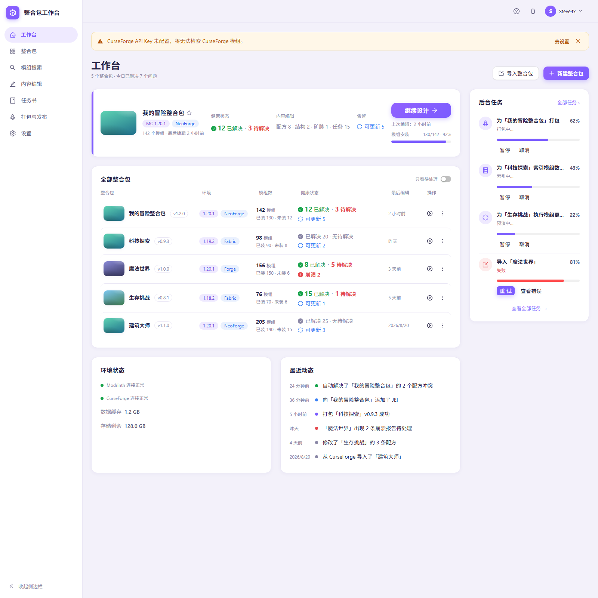

# mPackStation

> 从搜索到打包，不启动游戏，完成你的整合包。

mPackStation 是一个本地的 Minecraft 整合包设计工作台：在网页里完成选模组、锁依赖、解冲突、改内容（配方/结构/矿脉/任务书）、打包发布，全程不需要启动游戏，也不需要打开外部编辑器。



## 产品原则

- **整合包是唯一的工作对象**：新建/导入包 → 面向包搜索模组 → 加入整合包 → 锁定依赖 → 在线改内容 → 一键打包。没有全局"本地模组清单"——包内清单（`pack_mods`）是唯一权威来源。
- **平台负责「解决」，不是「诊断」**：依赖与冲突由系统自动处理，用户看到的是「已解决 12 · 待解决 3」，而不是一堆报错。
- **信号驱动的工作台**：看板用统一的红/绿/蓝信号呈现每个包的健康状态，只看待处理一键过滤。
- **mock 先行的开发方式**：每个页面先有 `docs/` 里的自含规格文档（行为 + 数据契约 + 设计令牌 + 验收标准），mock 数据驱动、截图验收通过后，才接真实后端。

## 功能现状

- [x] 看板（工作台）：空态迎新流程（上手三步、四步入门）、有包态总览（继续设计卡、包列表、后台任务面板、环境状态、最近动态）
- [x] 环境自检：CurseForge API Key 未配置、平台不可达、存储空间不足时自动横幅提示
- [x] Go + SQLite 后端骨架：单库 schema（包/包内模组/jar 索引/任务/冲突/动态/设置/远端缓存）
- [ ] 包工作台：搜索模组 → 加入整合包（设计中文档先行）
- [ ] 依赖锁定与冲突自动解决
- [ ] 内容编辑（配方/结构/矿脉/任务书）
- [ ] 一键打包与发布（CurseForge / Modrinth）

## 技术栈

| 层 | 选型 |
| --- | --- |
| 前端 | React 19 · TypeScript · Vite 7 · antd 6 · zod 4 |
| 后端 | Go（标准库 net/http）· SQLite（[modernc.org/sqlite](https://gitlab.com/cznic/sqlite)，纯 Go 无 cgo） |
| 数据 | 单库 `data/mpackstation.db`，业务表按 `pack_id` 分域；jar 索引按 sha1 跨包共享去重；平台原始 JSON 不落库只存路径 |

分发形态后续再定：单 exe 本地服务、Electron、Tauri 都可以无成本接住，当前只做开发环境。

## 快速开始

环境要求：Node.js 20+、Go 1.27+（仓库内 `.tools/` 可放便携版 Go，不入库）。

```bash
# 前端（http://127.0.0.1:5273，?mock=empty 查看空态）
cd apps/web
npm install
npx vite --port 5273

# 后端（http://127.0.0.1:18871，前端 /api 已代理到此端口）
cd apps/server
go run ./cmd/server -data ../../data
```

验证后端：`curl http://127.0.0.1:18871/api/health` 应返回 `{"status":"ok","db":true,...}`。

> 端口约定：前端 5273、后端 18871。本机 5173 / 18765 / 18766 可能被其他本地服务占用，请勿复用。

## 项目结构

```
apps/web/       前端（React + antd）
apps/server/    Go 后端（cmd/server + internal/store）
docs/           页面规格文档（唯一真相）与视觉规范
docs/project-state/   项目检查点（state.json / HANDOFF.md / history/）
data/           运行期生成（数据库 / 缓存），不入库
.tools/         本地工具链（便携 Go），不入库
.shots/         界面验收截图
```

## 文档

- [看板页面规格与视觉规范](docs/dashboard-page-prompt.md)
- [产品 UI Design System](docs/design-system.md)
- [项目交接 HANDOFF](docs/project-state/HANDOFF.md)（持续更新）

## License

[MIT](LICENSE)
