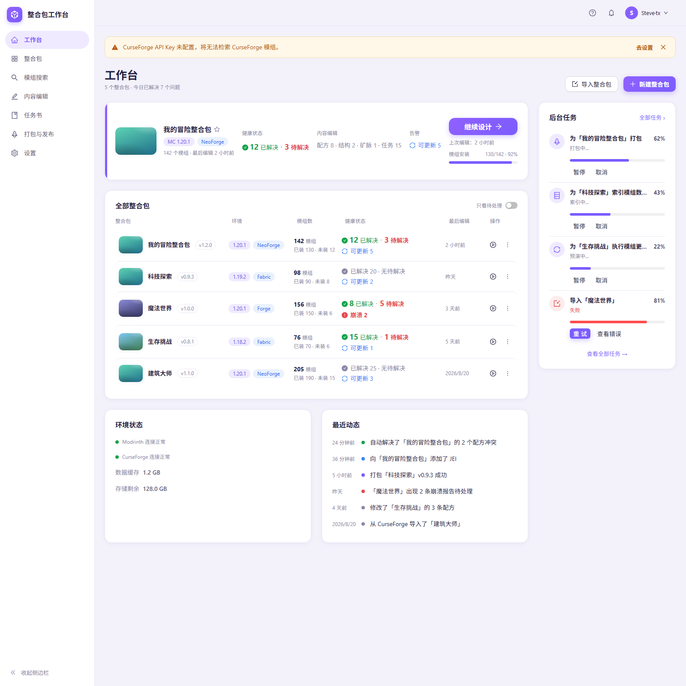

# mPackStation

> 从搜索到打包，不启动游戏，完成你的整合包。

mPackStation 是一个本地的 Minecraft 整合包设计工作台：在网页里完成选模组、锁依赖、解冲突、改内容（配方/结构/矿脉/任务书）、打包发布，全程不需要启动游戏，也不需要打开外部编辑器。



## 产品原则

- **整合包是唯一的工作对象**：新建/导入包 → 面向包搜索模组 → 加入整合包 → 锁定依赖 → 在线改内容 → 一键打包。没有全局"本地模组清单"——包内清单（`pack_mods`）是唯一权威来源。
- **平台负责「解决」，不是「诊断」**：依赖与冲突由系统自动处理，用户看到的是「已解决 12 · 待解决 3」，而不是一堆报错。
- **信号驱动的工作台**：看板用统一的红/绿/蓝信号呈现每个包的健康状态，只看待处理一键过滤。
- **mock 先行的开发方式**：每个页面先有 `docs/` 里的自含规格文档（行为 + 数据契约 + 设计令牌 + 验收标准），mock 数据驱动、截图验收通过后，才接真实后端。

## 功能现状

以实测结论为准，不是设计意图的清单：上一轮基线 `docs/tests/e2e-baseline-2026-09-29.md`（`PASS=27 FAIL=3`）暴露的缺陷已在 09-30 这轮收口，全链路（前端请求 → 后端入库 → 产物落盘 → 启动器）复测见 `docs/tests/chain-test-2026-09-30.md`（173 例，`PASS 172 / FAIL 0 / SKIP 1`），缺陷逐条台账见 `docs/tests/defects-2026-09-30.md`。**流水线终局已跑通一次真的**：`scripts/verify-terminal-chain.sh --launch` 用 cargo 编译出的内核装包并启动 Minecraft（43 条断言全绿，证据 `docs/tests/evidence/terminal-run-2026-09-30.log`）。

- [x] 看板（工作台）：空态迎新流程、有包态总览（继续设计卡、包列表、后台任务面板、环境状态、最近动态）
- [x] 环境自检：CurseForge API Key 未配置、平台不可达、存储空间不足时自动横幅提示
- [x] Go + SQLite 后端：schema 27（migrations 0001-0027，含 `0025` 目录物品证据 `lang`、`0026` 图标缺失原因、`0027` 包内模组自定义分类），单库分域，73+ 路由，Host/Origin 白名单 + 写令牌
- [x] 包工作台：面向包的双平台搜索 → `/mod-versions` 兼容版本 → 添加即钉版（镜像字段）→ 包内清单权威
- [x] 依赖锁定与冲突：锁快照 + 冲突列表 + 兼容知识库自动加装补丁
- [x] 内容编辑：包内物品/方块/配方/标签/多语言目录（含中文资源与等距投影图标）、配方查看、原版进度树画布、FTB 风格任务书（草稿/校验/应用/预览/历史）
- [x] 启动器内核 `launcherCore/`（Rust）：Java 下载、四种加载器安装、微软 OAuth + 离线账号、错误分类。**macOS 本机真编译真运行**（`cargo` 由 brew rustup 提供，工具链在 `~/.rustup/toolchains/stable-aarch64-apple-darwin`，默认不在 PATH——之前"本机无 cargo/rustc、从未编译"是误判）
- [x] **构建 .mrpack**（基线 D1 已修）：服务端按权威链 `pack_mods.current_selection_id → pack_mod_selections → selection_platform_pins(role='primary') → platform_release_files` 自行装配 manifest，产物是真实 `.mrpack`（终局验证里 901 字节，JEI/fabric-api/mezzconfig 三条真实 Modrinth 下载地址 + sha1/sha512）。构建不需要外网——jar 字节不入库，manifest 只记 URL 与哈希。构建前有冲突闸门（缺陷 O20）：还有 error 级未解决冲突就不许构建，否则装进游戏是 Fabric 的 "Mod resolution failed"。局限：只有本机 jar、没有平台选中项的本地模组进不了 `.mrpack`（见缺陷文档）
- [x] **启动器后端集成**（基线 D5 已修）：二进制路径走 `MPACK_LAUNCHER_BIN` 环境变量，安装记录落 `launcher_installs`（版本 ID 契约 `fabric-loader-<loader>-<mc>`，与内核 `loader/fabric.rs` 一致），`GET /api/launcher/installs` 可查，未安装时 409 `launcher_not_installed`。**用真内核验过**：`scripts/verify-terminal-chain.sh --launch` 一路走到游戏起窗（链路测试默认那套仍用协议桩，只为每轮快跑）
- [x] **装配产物 → 启动的最后一环**（缺陷 O14 已修）：内核 `launcherCore/src/mrpack.rs` 读 `.mrpack`（解析 manifest → 下载 `files[]` → 校验 sha1 → 落 `overrides/`），`install --mrpack <包>` 走同一条安装链路；实测 Minecraft 1.21.1 + Fabric 0.16.14 + 3 个模组装完起窗，进程存活、Fabric 横幅与渲染线程建号都在（`docs/tests/evidence/terminal-run-2026-09-30.log`）
- [ ] 发布到 CurseForge / Modrinth：接口存在但无凭证，本轮未验证（已确认为 by-design，无凭证必须拒绝）
- [x] 假数据残余：工作台右栏「包健康」等假展示已清理（无真实数据源的块移除或改为空态，死 CSS 一并删）

## 技术栈

| 层 | 选型 |
| --- | --- |
| 前端 | React 19 · TypeScript · Vite 7 · antd 6 · zod 4 |
| 后端 | Go（标准库 net/http）· SQLite（[modernc.org/sqlite](https://gitlab.com/cznic/sqlite)，纯 Go 无 cgo） |
| 数据 | 单库 `data/mpackstation.db`，业务表按 `pack_id` 分域；jar 索引按 sha1 跨包共享去重；平台原始 JSON 不落库只存路径 |

分发形态后续再定：单 exe 本地服务、Electron、Tauri 都可以无成本接住，当前只做开发环境。

关于"装配由服务器做还是本地做"：这里的"服务端"不是一个远端服务，而是跟界面一起装在用户机器上的那个 Go 进程。构建 `.mrpack` 只读本地 SQLite、写一个 zip，不需要任何网络与账号，因此同一份装配代码将来在 Electron 主进程里直接调用即可，不必搬到渲染层重写——重写反而会丢掉确定性（同一输入产出同一 zip）与迁移/事务的单一入口。

## 快速开始

环境要求：Node.js 20+、Go 1.27+（仓库内 `.tools/` 可放便携版 Go，不入库）。

```bash
# 唯一标准服务（AGENTS.md 定稿）：前端 5271 + 后端 18872
bash scripts/dev.sh
```

一键启停：`scripts/dev.sh`（启动）与 `scripts/dev-stop.sh`（停止）。

验证后端：`curl http://127.0.0.1:18872/api/health` 应返回 `{"status":"ready","db":true,...}`；存活探针为 `/api/healthz`，就绪探针为 `/api/readyz`。

两套**隔离**验证环境（各自独立端口与数据目录，绝不复用上面开发实例（18872/5271）与 `data/`、`/tmp/mpack-data`）：

```bash
bash scripts/chain-test-run.sh /tmp/chain-runN.log      # 前端→后端调用链路：后端 18872/18873 + /tmp/mpack-chain，启动器用协议桩
bash scripts/verify-terminal-chain.sh --launch          # 流水线终局：后端 18874 + /tmp/mpack-terminal，cargo 真编译内核 → 构建 .mrpack → 安装 → 真起 Minecraft
```

`verify-terminal-chain.sh` 会自己找 cargo：本机 rustup 由 brew 装，工具链在
`~/.rustup/toolchains/stable-<triplet>/bin`，默认不在 PATH（脚本里有兜底）。
`CARGO_TARGET_DIR` 固定在本地盘 `/tmp/mpack-launcher-target`，不放 SMB 挂载上。
`TERM_KEEP=1` 验完不杀后端与游戏进程。

> 端口约定（2026-10-03 定稿，权威文本见仓库根 `AGENTS.md`「服务与环境铁律」）：**前端 5271、后端 18872**，数据目录 `/tmp/mpack-data`。5173 / 5273 / 5274 / 5275 / 5276 / 18871 / 18873 / 18874 / 18880 一律作废，禁止另开实例；起停只用 `scripts/dev.sh` / `scripts/dev-stop.sh`。
>
> 跨机访问：dev 前端绑 `0.0.0.0`，另一台设备用 `http://<本机局域网 IP>:5271` 打开即可，接口经 vite 代理回本机后端（后端只绑回环，不直接对外）。若要用 mDNS 主机名而非 IP 访问，需同时给两端加白名单：vite 的 `server.allowedHosts` 与后端的 `MPACK_ALLOWED_HOSTS`。

### 写操作令牌

非 GET 请求需要 `X-MPack-Token` 请求头，与服务端环境变量 `MPACK_TOKEN` 一致。未设置时后端回落到 dev 令牌 `test`（后端代码里标注为 P2 待办）。前端从构建期变量 `VITE_MPACK_TOKEN` 读取，dev 下未设置时同样回落到 `test`。

生产部署必须同时设置两者：

```bash
MPACK_TOKEN=<强随机值> ./mpackstation-server
VITE_MPACK_TOKEN=<同一个值> npm run build
```

## 项目结构

```
apps/web/       前端（React + antd）
apps/server/    Go 后端（cmd/server + internal/store）
docs/           文档（按职能分子目录，见 docs/README.md）
data/           运行期生成（数据库 / 缓存），不入库
.tools/         本地工具链（便携 Go），不入库
.shots/         界面验收截图
```

## 文档

- [docs/README.md](docs/README.md) —— 文档目录结构说明
- [看板页面规格与视觉规范](docs/design/dashboard-page-prompt.md)
- [产品 UI Design System](docs/design/design-system.md)
- [后端架构 v7（权威）](docs/architecture/backend-architecture-v7.md)
- [项目交接 HANDOFF](docs/project-state/HANDOFF.md)（持续更新）

## License

[MIT](LICENSE)
