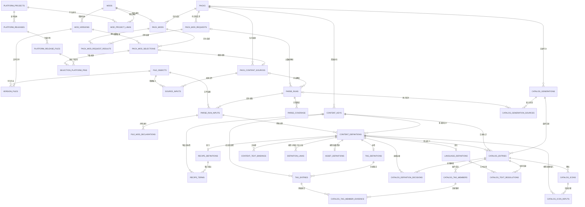

# 整合包与模组相关-表结构设计

- 日期：2026-09-08
- 状态：推荐方案，待评审；不是已实施的数据库结构。
- 业务输入：[Minecraft 原版与模组内容管理业务需求](./pack-scoped-mod-identity-requirements.md)。
- 范围：整合包、模组身份与版本、平台映射、文件、内容解析、包内最终目录。
- 本文不创建或执行 migration，不修改现有数据库。任务、审计、构建、发布、用户编辑文档等表沿用现有体系，只说明必要的关联调整。

## 1. 收敛结论

采用一套结构：

```text
模组稳定身份 → 精确模组版本 → 输入文件清单
       ↓              ↓
整合包 → 包内模组实例 → 不可变版本选择 → 包内内容来源
                                      ↓
                              解析批次 + 实际输入文件
                                      ↓
                              内容标识 + 多来源定义
                                      ↓
                              包内目录代次 + 最终结果
```

1. `mods.mod_id` 是稳定游戏内身份，例如 `minecraft`、`ae2`。平台、版本、加载器、整合包均不参与生成它。
2. `pack_mods` 是包内成员和当前选择的唯一权威入口，`UNIQUE(pack_id, mod_id)` 保证一个包内一个身份只有一个实例。
3. `pack_mod_selections` 保存不可变的历次选择；当前选择由实例上的一个外键指针确定，不用多行 `is_current` 竞争。
4. 精确版本由声明版本和输入文件清单区分。同一个版本字符串可以对应不同文件，不覆盖旧记录。
5. 原始内容归属于包内解析批次；最终内容归属于包内目录代次。内容不得只通过版本字符串或“最新一次运行”判断有效性。
6. Minecraft 是固定身份为 `minecraft` 的内置模组。自动创建包内实例，走同一来源、解析和目录流程；获取原版资源允许使用专用适配器。
7. 身份字典、平台元数据和文件字节可跨包复用；包内状态、来源定义、目录结果不能跨包复用为可变业务记录。
8. 配方、标签、语言、模型和贴图统一保存“来源定义”；最终采用或合并结果另存，避免把原始证据覆盖掉。

### 1.1 本次相对讨论稿的收敛

- 保留一套统一 `content_keys` / `content_definitions`，不为物品、方块、模型、贴图各复制一套来源字段。
- 配方输入和输出统一为 `recipe_terms`，通过角色、槽位和候选序号区分。
- 元数据解析复用带包作用域的 `parse_runs`，不再另建一套全局元数据运行生命周期。
- 平台提供的多种校验值保存为 JSON 映射；文件真实身份仍使用实测 SHA-256。
- 标签成员证据使用直接条目引用和嵌套路径，不新增可任意递归的推导图。
- 使用 `catalog_definition_decisions` 保存顺序及采用原因，不额外维护可由这些记录推导的两两覆盖边。
- 物品／方块映射和资源引用共用 `definition_links`；图标输入单独保留，因为图标生成有独立状态。
- 未识别身份的添加行为使用明确的 `pack_mod_requests`；禁止临时造一个游戏身份。

### 1.2 与现行架构的关系

现行 v7 使用 `jar_index.sha1` 共享 JAR。本方案推荐文件代理主键加实测 SHA-256 唯一约束，同时保留 SHA-1 用于平台与历史兼容。这是待实施的架构演进，不能把本文当作现行执行基线已经变更。

实施时需补充对应 ADR，使用新增 migration，并调整锁文件、blob 引用与 GC；既有 migration 不修改。仍遵循 SQLite 单库、`store` 唯一 SQL 边界、service 事务编排、outbox 与短事务规范。

## 2. 实体定义

| 中文名称 | 表达的事实 | 不表达的事实 |
|---|---|---|
| 整合包 | 当前业务环境与 Minecraft／加载器配置 | 全局资源库 |
| 模组身份 | 文件声明的稳定游戏身份 | 平台项目或某次下载 |
| 精确模组版本 | 某身份的声明版本及确定输入文件集合 | 仅一个人类可读版本号 |
| 包内模组实例 | 模组在包内的成员关系、状态和当前选择 | 跨包共享安装状态 |
| 包内版本选择 | 实例选择某个精确版本的一次记录 | 可以原地替换输入的记录 |
| 平台项目／发布文件 | 搜索、下载、镜像和更新的外部依据 | 游戏身份的权威 |
| 文件对象 | 经校验的确定字节 | 缓存路径本身 |
| 内容来源 | 包内某个版本选择或外部输入提供内容的身份 | 资源命名空间 |
| 解析批次 | 在确定环境和输入下的一次解析 | 同文件永远有效的成功标记 |
| 内容标识 | 包内某类资源的地址 | 该资源确定存在的证明 |
| 来源定义 | 某次解析从某文件得到的一份定义 | 当前一定生效的定义 |
| 目录代次 | 对一份确定包输入生成的结果快照 | 可混入其他代次的查询集合 |

## 3. 通用字段、约束和生命周期

### 3.1 字段记法

下文每张表列出字段、主键、唯一约束及外键规则，作为逻辑物理结构设计；不是可直接执行的 SQL。

- `T` = SQLite `TEXT`；`I` = `INTEGER`；`J` = `TEXT` 且 `CHECK(json_valid(...))`。
- `?` 表示允许 NULL；未带 `?` 的字段均为 NOT NULL。
- 布尔字段为 `I CHECK(value IN (0,1))`；计数、尺寸按适用情况校验非负或正数。
- 时间统一 Unix 毫秒。实体 ID 为无业务含义的 `TEXT`，不从展示名生成。
- 下文 `P` 是真实列名 `pack_id T`，`G` 是 `generation_id T`，仅为缩短表格。
- 全局实体表以 `id T` 为代理主键；`mods` 使用 `mod_id T` 自然主键。
- 包内实体表使用 `PK(P,id)`；包内明细表使用各表列出的复合主键。
- 所有含 `P` 的根表外键指向 `packs(id)`；所有包内关联外键必须带 `P`。目录内部关联同时带 `(P,G)`。
- `created_at I`：除纯连接表和可重建目录明细外均有；可变实体另有 `updated_at I`。后文不重复列出这两个公共字段。
- 本文列出的 `UNIQUE` 对应候选键；不要另加“版本名唯一”“一个平台项目只能一个游戏身份”等未声明约束。

### 3.2 约束实现分层

- 普通归属：复合 FK。
- 唯一性、枚举、非空、计数、JSON：数据库约束。
- 引用正确内容类型、指针属于同一实例、运行与来源一致：优先补充复合唯一键与 FK；仍跨多跳的关系使用触发器校验。
- Minecraft 实例必须存在、目录原子发布、完整度政策、平台下载验证：service 事务编排；数据库触发器兜底可表达的一致性。
- SQLite CHECK 不用于跨表查询。不得把跨表规则写成无法执行的 CHECK。
- service 与 repository 的所有业务入口均接收 `pack_id`；读取共享元数据也先从当前包的实例／请求／文件引用建立上下文，不能借共享表遍历其他包数据。

### 3.3 保留与删除

- 删除整合包：级联删除其包内数据，同时登记文件清理候选；不在数据库事务内删除物理文件。
- 版本、文件、来源输入、完成的批次及来源定义不可原地换内容；修正或重解析产生新记录。
- 共享身份、版本、平台记录与文件，仍被引用时 `ON DELETE RESTRICT`。
- 删除历史代次先清除当前指针，再删除其派生明细；来源证据被保留代次引用时不能删除。
- 解析批次删除可级联其明细，但必须先确认不被目录引用。包级删除按目录、解析、选择依赖顺序在事务内处理。
- 文件可有多条位置记录；缓存失效仅更新位置可用性，不能抹去文件哈希与来源证据。
- 长期保留天数是待确认政策；最低要求是不得清除当前选择、当前目录及它们依赖的证据。

## 4. 身份、版本、文件与平台表

| 表名／中文名 | 字段（含类型） | 主键、候选键与关联 |
|---|---|---|
| `mods` 模组身份 | `mod_id T, display_name T, kind T` | PK `mod_id`；kind=`normal/builtin`。内置 Minecraft 固定为 `minecraft` |
| `mod_versions` 精确模组版本 | `id T, mod_id T, declared_version T, input_manifest_sha256 T` | PK `id`；U `(mod_id,declared_version,input_manifest_sha256)`；U `(mod_id,id)`；FK mod_id→mods |
| `file_objects` 文件对象 | `id T, sha256 T, sha1 T?, size_bytes I, media_type T` | PK id；U sha256；sha256 为实测 64 位小写十六进制，sha1 有值时为 40 位；大小≥0 |
| `file_locations` 文件位置 | `file_id T, location T, availability T, verified_at I?` | PK `(file_id,location)`；FK file_id→file_objects；availability=`available/missing/corrupt` |
| `version_files` 版本文件清单 | `version_id T, role T, logical_path T, file_id T, required I` | PK `(version_id,role,logical_path)`；FK version_id→mod_versions、file_id→file_objects |
| `version_compatibility` 版本兼容信息 | `version_id T, ordinal I, mc_constraint T, loader_name T, loader_constraint T, conditions J, evidence J` | PK `(version_id,ordinal)`；FK version_id→mod_versions；每行是联合条件，不拆成互不关联的版本和加载器数组 |
| `platform_projects` 平台项目 | `id T, platform T, external_project_id T, slug T, display_name T` | PK id；U `(platform,external_project_id)`；platform=`modrinth/curseforge` |
| `mod_project_links` 身份与项目映射 | `mod_id T, project_id T, status T, evidence J, confirmed_at I?` | PK `(mod_id,project_id)`；两侧 FK；status=`candidate/confirmed/rejected` |
| `platform_releases` 平台发布 | `id T, project_id T, external_version_id T, version_name T, published_at I?` | PK id；U `(project_id,external_version_id)`；FK project_id→platform_projects |
| `platform_release_files` 平台文件声明 | `id T, release_id T, file_key T, file_name T, download_url T, expected_size I?, expected_hashes J, file_id T?, verification_status T` | PK id；U `(release_id,file_key)`；FK release_id→platform_releases、file_id→file_objects；校验状态=`pending/verified/mismatch` |
| `version_release_files` 版本平台文件对应 | `version_id T, release_file_id T, status T, evidence J` | PK `(version_id,release_file_id)`；两侧 FK；status=`candidate/verified/rejected` |

### 4.1 精确版本规则

`input_manifest_sha256` 对规范排序后的 `(role,logical_path,file_sha256,required)` 清单计算，不包含包 ID、缓存目录和平台项目 ID。版本及清单在同一事务建立，之后不修改；补入新文件形成新清单与新精确版本。

- 相同模组、相同声明版本、相同文件清单：同一精确版本。
- 相同声明版本、不同 JAR 字节：不同精确版本。
- 不同下载平台提供相同文件：可以映射同一精确版本。
- 不同加载器构建产生不同文件：精确版本不同，`mods.mod_id` 不变。
- 兼容条件保存原始表达式与来源；未知不能用空数组解释成“兼容全部”。
- 原版输入包括客户端 JAR、版本元数据、资源索引及实际使用的独立资源。未下载完毕时停留在准备流程，不能声称正式清单已经完整。
- 添加另一语言资源形成新输入清单；声明 Minecraft 版本不变，原版精确版本选择可以更新，并触发新目录代次。
- 文件对象不限于 JAR，也承载贴图原始字节和生成图标；是否为下载输入由引用角色区分。

## 5. 包内成员、选择与来源表

| 表名／中文名 | 字段（含类型） | 主键、候选键与关联 |
|---|---|---|
| `packs` 整合包 | `id T, name T, description T, mc_version T, loader T, loader_version T, status T, config_revision I, current_generation_id T?` | PK id；沿用当前 U name；config_revision>0；当前目录 FK `(id,current_generation_id)`→catalog_generations `(P,id)`；既有图标、归档等字段继续保留 |
| `pack_mods` 包内模组实例 | `P, id T, mod_id T, display_name T, origin T, status T, required I, current_selection_id T?` | PK `(P,id)`；U `(P,mod_id)`；U `(P,id,mod_id)`；FK mod_id→mods；当前选择关联规则见下文 |
| `pack_mod_requests` 待识别添加请求 | `P, id T, acquisition T, release_file_id T?, local_locator T?, requested_version T?, status T, diagnostics J` | PK `(P,id)`；平台文件可空 FK；未确认身份前停留此表；status=`pending/resolving/resolved/failed/canceled` |
| `pack_mod_request_results` 请求解析结果 | `P, request_id T, pack_mod_id T` | PK `(P,request_id,pack_mod_id)`；两侧包内 FK；允许一个文件识别出多个模组实例 |
| `pack_mod_selections` 不可变版本选择 | `P, id T, pack_mod_id T, mod_id T, version_id T, acquisition T, requested_version T` | PK `(P,id)`；U `(P,pack_mod_id,id)`；FK `(P,pack_mod_id,mod_id)`→pack_mods；FK `(mod_id,version_id)`→mod_versions |
| `selection_platform_pins` 平台固定项 | `P, selection_id T, role T, release_file_id T` | PK `(P,selection_id,role,release_file_id)`；选择与平台文件 FK；role=`primary/mirror`；部分唯一索引 `(P,selection_id)` WHERE role='primary' |
| `pack_content_sources` 包内内容来源 | `P, id T, kind T, selection_id T?, external_revision T?, display_name T, descriptor J` | PK `(P,id)`；FK `(P,selection_id)`→选择；U `(P,selection_id)` WHERE selection_id IS NOT NULL；kind=`mod/datapack/resourcepack/document/runtime` |
| `source_inputs` 来源输入文件 | `P, source_id T, input_no I, file_id T, role T, logical_path T, provenance J` | PK `(P,source_id,input_no)`；U `(P,source_id,role,logical_path)`；来源及文件 FK |

### 5.1 状态和指针约束

- `pack_mods.origin`：`manual/compat_fix/builtin`；`status`：`pending/installed/disabled/removed`。
- `acquisition`：`local/modrinth/curseforge/mojang`。获取方式与添加原因是两列，不能混为一个 source。
- 当前选择 FK 为 `(P,id,current_selection_id)`→`pack_mod_selections(P,pack_mod_id,id)`，保证属于同一实例。
- 已安装实例必须有当前选择；身份已确认但文件清单仍在准备时可以保持 pending、指针为空。
- 选择只在精确版本确认后建立，因此 `version_id` 非空；未决状态放在请求和任务中，不让选择成为可变下载草稿。
- `kind=mod` 必须有 selection_id，其他来源种类必须没有 selection_id，并有明确 external_revision。来源创建后不换归属。
- 模组来源的 `source_inputs` 必须与所选精确版本文件清单一致；来源输入清单冻结后才可产生正式内容批次。
- 镜像平台固定项允许多个，但每个必须有单独验证证据；“项目对应”不自动证明“两个具体文件相同”。
- 禁用／移除不删除实例，重新加入复用实例并产生新选择。实例 ID 在包内稳定。

### 5.2 Minecraft 不变量

创建已配置整合包的同一事务中创建 `mod_id=minecraft` 实例，`display_name=Minecraft`、`origin=builtin`。文件准备前实例 pending，随后绑定声明版本等于 `packs.mc_version` 的精确版本。

每个包最多一个 Minecraft 由唯一约束保证；至少一个由创建事务与删除／配置变更校验保证。修改 Minecraft 版本必须同时使旧选择失效，进入新版本准备流程。

搜索、普通依赖安装和普通模组更新流程按 builtin 类型排除 Minecraft；不能假装它具有 Modrinth／CurseForge 项目。是否允许用户禁用或移除 Minecraft 仍需产品确认，正常已配置包的结构要求它存在。

## 6. 解析批次、文件声明与原始定义表

| 表名／中文名 | 字段（含类型） | 主键、候选键与关联 |
|---|---|---|
| `parse_runs` 解析批次 | `P, id T, source_id T?, request_id T?, phase T, task_id T?, config_revision I, environment J, environment_sha256 T, parser_version T, input_sha256 T, execution_status T, completeness T, total_files I, parsed_count I, partial_count I, dynamic_count I, unsupported_count I, error_count I, started_at I?, finished_at I?, diagnostics J` | PK `(P,id)`；U `(P,source_id,id)`；source／request 包内 FK；phase=`metadata/content`；任务存在时校验 tasks.pack_id=P |
| `parse_run_inputs` 实际解析输入 | `P, run_id T, input_no I, file_id T, source_input_no I?, logical_path T, actual_sha256 T` | PK `(P,run_id,input_no)`；运行和文件 FK；实测哈希必须等于文件对象哈希；content 阶段还需匹配该运行来源的输入文件 |
| `file_mod_declarations` 文件模组声明 | `P, run_id T, input_no I, descriptor_path T, ordinal I, declared_mod_id T, declared_version T, resolved_mod_id T?, metadata J, status T` | PK `(P,run_id,input_no,descriptor_path,ordinal)`；FK `(P,run_id,input_no)`→批次输入；resolved_mod_id→mods；保留文件原文身份与解析结果 |
| `parse_coverage` 分类覆盖情况 | `P, run_id T, kind T, resource_status T, completeness T, scanned_count I, parsed_count I, partial_count I, dynamic_count I, unsupported_count I, invalid_count I, diagnostics J` | PK `(P,run_id,kind)`；运行 FK；零结果也必须写覆盖记录 |
| `content_keys` 包内内容标识 | `P, id T, kind T, registry T, resource_key T, qualifier T` | PK `(P,id)`；U `(P,kind,registry,resource_key,qualifier)`；无适用维度保存非空空串 |
| `content_definitions` 来源定义 | `P, id T, key_id T, run_id T, input_no I, archive_path T, fragment_key T, raw_file_id T?, raw_text T?, normalized J?, parse_status T, runtime_status T, conditions J, diagnostics J` | PK `(P,id)`；U `(P,id,key_id)`；U `(P,run_id,input_no,archive_path,fragment_key,key_id)`；内容标识、批次输入、原始文件 FK |

### 6.1 解析与来源约束

- metadata 阶段必须有 request_id 或 source_id 中恰好一个；content 阶段必须有 source_id 且 request_id 为空。
- 内容定义仅允许引用 content 阶段运行。来源链为：定义→批次→来源→选择→包内实例→稳定模组身份。
- 物理证据链为：定义→批次输入→文件对象。原始文件中的 JSON 片段由 archive_path、fragment_key 定位。
- 原始内容至少保存 `raw_file_id` 或 `raw_text` 之一；损坏 JSON 的 normalized 可以为空，原始字节不能丢弃。
- `file_mod_declarations` 保存一个文件的全部声明，不把第一条声明自动当成全部资源的提供者。
- Minecraft 缺少普通模组描述符时，由受校验的版本元数据形成内置声明证据，并在 metadata 中注明适配器来源；不得伪称来自普通模组描述文件。
- 多身份 JAR 内容若无法精确归属，不进入某个随意选定实例的成功目录；保留解析诊断和输入，等待明确归属规则。
- 幂等依据至少包含来源、精确输入、解析器版本和环境指纹。失败后重试建立新 run，不覆盖旧 run。

### 6.2 内容种类与状态

`content_keys.kind` 支持 `item/block/recipe/tag/lang/model/texture/blockstate/loot_table/advancement/ammo_definition`。既有普通模组 structure/worldgen 原始数据可保留，但不属于本阶段原版目录必备范围。

- item、block、recipe 的 resource_key 为完整资源标识。
- tag 的 registry 为 item 或 block；同名不同 registry 是不同标签。
- lang 的 resource_key 为文本键，qualifier 为语言，如 zh_cn。
- model 的 qualifier 区分 item/block/entity 等形式。
- 创建引用用的 key 不表示物品已注册、标签存在或资源有效。必须检查目录状态和证据。

| 维度 | 枚举 | 含义 |
|---|---|---|
| execution_status | queued/running/succeeded/failed/canceled | 任务执行结果 |
| parse_status | parsed/partial/unsupported/invalid | 单份定义解析程度 |
| runtime_status | static/dynamic/unknown | 是否依赖运行时 |
| resource_status | pending/ready/missing/failed | 输入资源准备程度 |
| completeness | complete/partial/unresolved | 批次或分类完整程度 |

“执行成功”不等于“解析完整”。计数口径分别统计扫描文件和逻辑定义，字段不能相加后假定等于扫描文件数。动态属性与解析程度可能重叠，dynamic_count 是属性计数。

## 7. 配方、标签、多语言和资源明细表

| 表名／中文名 | 字段（含类型） | 主键、候选键与关联 |
|---|---|---|
| `recipe_definitions` 配方明细 | `P, definition_id T, recipe_type T, layout J` | PK `(P,definition_id)`；FK→对应 recipe 来源定义 |
| `recipe_terms` 配方材料与输出 | `P, definition_id T, role T, slot I, alternative I, ref_kind T, target_key_id T?, count I?, position J, predicate J, raw_term J` | PK `(P,definition_id,role,slot,alternative)`；配方、目标内容标识 FK；role=`input/output`；ref_kind=`item/item_tag/unknown`；已知 count>0 |
| `tag_definitions` 标签定义 | `P, definition_id T, replace_existing I` | PK `(P,definition_id)`；FK→对应 tag 来源定义 |
| `tag_entries` 标签直接条目 | `P, definition_id T, ordinal I, operation T, target_kind T, target_key_id T, required I, conditions J, raw_entry J` | PK `(P,definition_id,ordinal)`；标签定义和内容标识 FK；operation=`add/remove`；target_kind=`member/tag` |
| `language_definitions` 语言条目 | `P, definition_id T, text T` | PK `(P,definition_id)`；FK→lang 来源定义；语言和文本键从 key 读取 |
| `content_text_bindings` 文本键绑定 | `P, definition_id T, role T, ordinal I, translation_key T, evidence J` | PK `(P,definition_id,role,ordinal)`；来源定义 FK；role 如 display_name/description |
| `definition_links` 内容与资源关联 | `P, definition_id T, ordinal I, role T, from_key_id T, to_key_id T, detail J, certainty T` | PK `(P,definition_id,ordinal)`；来源定义和两侧 key 的包内 FK；保存关系来源 |
| `asset_definitions` 模型／贴图／状态资源明细 | `P, definition_id T, form T, data_file_id T?, mime T?, width I?, height I?, support_status T, reason T` | PK `(P,definition_id)`；定义及文件 FK；form=`item/block/entity/texture/blockstate`；已有尺寸>0 |

规则：

1. recipe_terms 同一 input slot 的不同 alternative 是“任一候选”；不同 slot 是分别需要的输入。布局保存真实行列和尺寸，不固定为 3×3。
2. 输出只把静态可确认的物品作为 item；动态输出保留 raw_term、target 为空，不能强造一个确定物品。未知数量为 NULL，不能默认写 1。
3. item_tag 必须指向 item registry 标签；item 指向物品。不支持的扩展谓词保留原文并标 partial/unsupported。
4. tag_entries 的 member 目标类型由标签 registry 决定；嵌套标签必须同 registry。replace 是整份定义的操作，remove 是条目操作，两者均保留。
5. definition_links.role=`item_block/model_parent/model_texture/item_model/block_model/blockstate_model`。两侧 key 的类型由 role 校验；detail 保存贴图变量、模型变体条件等。
6. 引用、模型推断和注册证据区别保存在 certainty/evidence 中。只有被配方提及不能证明物品实际存在。
7. language 的同语言同文本键可以有多来源定义；按目录规则选取，不能在原始表原地覆盖。
8. 普通 JSON 内容沿用 normalized；模型原始结构和继承关系同时保留，贴图字节通过 data_file_id 保留。

## 8. 目录、采用决策、标签展开和图标表

| 表名／中文名 | 字段（含类型） | 主键、候选键与关联 |
|---|---|---|
| `catalog_generations` 包内目录代次 | `P, id T, config_revision I, environment J, input_sha256 T, resolver_version T, status T, completeness T, started_at I, finished_at I?, diagnostics J` | PK `(P,id)`；包 FK；status=`building/ready/failed/superseded`；不对 config_revision 单独唯一，同配置可以重建 |
| `catalog_generation_sources` 目录输入快照 | `P, G, source_id T, run_id T?, inclusion_status T, priority I?, order_evidence J, condition_result T` | PK `(P,G,source_id)`；目录、来源 FK；运行 FK `(P,source_id,run_id)`→parse_runs；run 为空明确表示该来源尚未准备 |
| `catalog_entries` 最终内容条目 | `P, G, key_id T, winner_definition_id T?, availability T, completeness T, diagnostics J` | PK `(P,G,key_id)`；目录、key FK；winner 通过 `(P,winner_definition_id,key_id)`→定义，保证同一 key |
| `catalog_definition_decisions` 定义采用决策 | `P, G, definition_id T, key_id T, decision T, precedence I?, condition_result T, reason T, evidence J` | PK `(P,G,definition_id)`；FK `(P,definition_id,key_id)`→定义，`(P,G,key_id)`→目录条目 |
| `catalog_tag_members` 标签展开成员 | `P, G, tag_key_id T, member_key_id T, certainty T` | PK `(P,G,tag_key_id,member_key_id)`；两侧目录条目 FK；certainty=`confirmed/possible` |
| `catalog_tag_member_evidence` 成员来源证据 | `P, G, id T, tag_key_id T, member_key_id T, definition_id T, entry_ordinal I, nested_path J` | PK `(P,G,id)`；成员行和原始 tag_entries FK；路径按顺序记录全部嵌套贡献坐标 |
| `catalog_tag_issues` 标签未决与缺失项 | `P, G, id T, tag_key_id T, definition_id T?, entry_ordinal I?, target_key_id T?, code T, detail J` | PK `(P,G,id)`；标签目录条目 FK、可空原始条目 FK；definition_id 与 entry_ordinal 同空或同非空 |
| `catalog_text_resolutions` 多语言最终显示 | `P, G, key_id T, role T, requested_locale T, text T, resolved_locale T?, fallback_kind T, language_definition_id T?, binding_definition_id T?` | PK `(P,G,key_id,role,requested_locale)`；目录条目及定义包内 FK；language 必须指向本代次采用的语言定义 |
| `catalog_item_block_links` 最终物品方块关系 | `P, G, item_key_id T, block_key_id T, definition_id T, link_ordinal I` | PK `(P,G,item_key_id,block_key_id,definition_id,link_ordinal)`；两侧目录条目与 definition_links FK；允许同关系多份证据 |
| `catalog_icons` 最终图标 | `P, G, key_id T, view_kind T, status T, file_id T?, width I?, height I?, mime T?, source_kind T, renderer_version T, input_sha256 T?, reason T` | PK `(P,G,key_id,view_kind)`；目录条目和输出文件 FK；ready 时文件、尺寸、格式非空，尺寸>0 |
| `catalog_icon_inputs` 图标输入来源 | `P, G, key_id T, view_kind T, definition_id T, role T` | PK `(P,G,key_id,view_kind,definition_id,role)`；图标与定义 FK；定义必须是本代次的采用输入 |

### 8.1 必须执行的跨表规则

- 输入来源快照冻结后不改 run_id；重跑产生新目录代次。
- 采用定义必须来自本代次纳入的来源及指定 run，不能只检查 pack_id 一致。
- decision=`selected/contributed/overridden/excluded/unresolved`。非标签资源最终胜出使用 selected；标签多来源使用 contributed。
- winner 必须对应 selected 决策；对 selected 建立部分唯一索引 `(P,G,key_id)`，保证最多一份胜出。
- tag 的 winner 为空，通过决策和成员表表达合并；普通资源 unresolved 时也可为空。
- priority/precedence 为空表示顺序未知。内部 ID 排序只可用于稳定展示，不产生确定加载顺序。
- condition_result=`true/false/unknown`，不把未知条件当成 true。
- 标签 confirmed 表示在已知顺序与条件下可证明的成员；possible 仅作诊断候选，普通配方匹配不能当作确定材料。
- 未知 replace/remove 可能影响已有成员时，不能继续把受影响成员标 confirmed。无法求可靠边界时整个标签 unresolved。
- nested_path 内坐标由构建器逐项校验属于本包、本代次采用的贡献；JSON 语法校验不能替代引用验证。
- availability=`available/reference_only/missing/dynamic/unsupported/invalid/pending`。明确区分注册／资源证据与纯引用。
- 图标 view_kind=`inventory/block_preview/entity_preview`；status=`pending/ready/missing/dynamic/unsupported/failed`。不同展示形式独立存储，不自动互用。
- 当前目录的内容决策和关系发布后不可变；图标、语言派生缓存可在固定代次下补齐，但必须校验输入指纹和渲染／回退规则版本。改变原始输入必须新建代次。

### 8.2 关键索引

除 PK/U 自动形成的索引外，至少增加：

```text
pack_mods(P,status,mod_id)
parse_runs(P,source_id,created_at DESC)
parse_runs(P,request_id,created_at DESC)
content_definitions(P,run_id,key_id)
content_definitions(P,key_id,run_id)
catalog_generation_sources(P,run_id)
catalog_definition_decisions(P,G,key_id,precedence)
catalog_tag_members(P,G,member_key_id,tag_key_id)  -- 物品反查标签
catalog_text_resolutions(P,G,requested_locale,text)
version_files(file_id)
source_inputs(file_id)
parse_run_inputs(file_id)
```

其余共享文件引用外键根据 GC 查询补充索引。当前目录读取始终通过包的 current_generation_id，不查询“全表最新 G”。

## 9. 创建、切换与发布事务

### 9.1 创建整合包

1. 短事务创建 packs、Minecraft 实例及准备任务／outbox；config_revision 初始为 1。
2. 事务外获取并验证指定 Minecraft 版本输入，缺失时保存 pending/failed 及分类覆盖情况。
3. 建立精确版本、选择、来源与冻结输入清单；事务内绑定 Minecraft 当前选择并推进 config_revision。
4. 发起统一 content 解析，保存批次与原始定义；随后构建新目录代次。
5. 提交前核对修订号、当前选择和输入指纹，一致才设置目录指针。

### 9.2 模组或 Minecraft 切换版本

用户确认切换后，短事务增加 config_revision，使旧目录立即对当前业务失效。新文件未准备完成时实例 pending；不得继续把旧选择解释为新版本。旧选择可保留用于历史证据，但正常内容入口拒绝读取旧目录。

Minecraft 配置变化必须同时使 minecraft 实例进入新版本准备状态。加载器与加载器版本变化也推进 config_revision，重新评估普通模组兼容性与条件内容。

新选择建立后切换当前指针，再解析、构建。旧异步任务可保存自己的结果，但通过修订号与输入比较拒绝成为当前目录。切回旧文件也必须明确绑定其正确批次，不得仅因历史成功记录而复用另一文件的内容。

### 9.3 目录发布

一个事务完成：

1. 验证 `generation.config_revision = packs.config_revision`。
2. 验证目录来源对应当前应纳入的选择、实例状态及解析批次。
3. 验证输入指纹与来源集合一致，决策／成员／图标均引用合法本代次输入。
4. 将代次状态置 ready，更新包 current_generation_id，并写入所需 outbox／活动证据。

`ready` 仅表示构建完成，完整程度由 completeness 单独表达。是否允许 partial 目录服务正常业务是产品政策；数据结构始终拒绝旧版本冒充当前版本。

## 10. 查询和场景落库

### 10.1 正常业务查询路径

| 操作 | 唯一查询路径 |
|---|---|
| 模组列表 | packs→pack_mods；Minecraft 自然出现在其中 |
| 查看当前模组原始内容 | 包→实例→当前选择→来源→与当前输入匹配的批次→定义 |
| 查看当前最终内容 | 包→current_generation_id→验证 config_revision→catalog_entries |
| 配方直接物品材料 | 当前胜出配方→recipe_terms→相同 `(P,G)` 的物品目录条目 |
| 配方标签材料 | 当前胜出配方→item_tag→相同 `(P,G)` 的标签及 confirmed 成员，并返回标签完整度 |
| 物品反查标签 | catalog_tag_members 按 `(P,G,member_key_id)` 查询 |
| 内容归属 | 定义→批次→来源→选择→实例→mod_id；不从 resource_key 前缀推断 |
| 名称 | 当前代次语言胜出定义→文本键绑定→zh_cn→en_us→资源标识，记录回退来源 |
| 图标 | 当前代次、内容标识、view_kind 三者确定一条结果；缺失时返回原因 |

### 10.2 典型记录关系

- **Minecraft**：全局 `mods.minecraft`；包 A、B 分别各有 minecraft 实例。原版版本号等于各包配置，但精确输入可以不同。专用下载适配器不改变统一业务链路。
- **同一模组跨包**：A/ae2 与 B/ae2 引用同一身份；相同输入可共用版本和文件，解析状态和目录完全独立。
- **同名版本不同文件**：声明版本相同，input_manifest_sha256 不同，建立两个版本记录；绝不原地换文件。
- **跨命名空间配方覆盖**：来源 X 提供 `minecraft:iron_ingot` 配方，key 是 minecraft 命名空间，提供者仍为 X。Y 再覆盖时保存两份定义与两条决策。
- **多来源标签**：同一标签 key，原版及模组各有 tag_definition。逐份应用条件与 replace，再处理 add/remove、嵌套展开，保存成员及所有有效贡献证据。
- **无法确认条件**：原定义和条目仍保留；未决原因进入 issues，不能通过空成员集合伪装成确定空标签。
- **中文覆盖**：两个来源提供同一 zh_cn 文本键，保留两份 language_definition，目录选取其中一份；无中文时保存英文定义 ID 和 resolved_locale=en_us。
- **模型复杂或动态内容**：资源 key 和证据存在，asset/definition 标明 unsupported/dynamic，图标保持对应状态，不从目录删除后声称内容不存在。
- **一 JAR 多模组**：metadata 批次保存全部声明；request_results 可产生多个实例，共用文件。无法归属的共享内容不重复计为每个模组各自提供，归属政策见待确认问题。

## 11. Mermaid ER 图

图中省略平台校验 JSON、公共时间和部分诊断明细；具体字段与复合外键以第 3～8 节为准。



## 12. 当前结构依据与迁移映射

依据 2026-09-08 工作目录中的迁移与实现，包含未提交文件；并未检查实际用户数据库已应用版本。

| 当前结构 | 已核实的事实 | 目标去向 |
|---|---|---|
| packs | 保存 Minecraft、加载器配置 | 保留业务字段，新增修订号和当前代次指针 |
| pack_mods | 平台项目／版本、sha1、状态、origin、mirror 信息混在同一行 | 成员字段保留；游戏身份、精确选择和平台固定项拆开 |
| mod_identity | 实际是 MR/CF 项目配对，各项目分别唯一 | 迁移平台项目映射证据，不能直接生成游戏身份 |
| jar_index | sha1 主键，mod_ids/loaders/mc_versions JSON；仓储会合并数组 | 校验实际字节后生成 file_objects、文件声明与兼容记录 |
| mod_content | 包内原始行按模组整体替换；没有 run/file FK | content_keys、content_definitions 与不可变批次 |
| mod_content_runs | U(mod_id,sha1)，重复运行更新同一行 | parse_runs，保留每次执行与解析器／环境版本 |
| pack_catalog_state | 修订失效检查、构建状态 | packs.config_revision 与 catalog_generations |
| pack_catalog_recipes | 每包每配方一个最终行，来源字符串 | recipe_definitions/terms，加目录采用决策 |
| pack_catalog_tag_* | 已有定义、replace/remove、嵌套边、成员和反查 | 保留能力，补齐批次归属、精确来源与代次 |
| pack_catalog_*_names/icons | 包内派生显示结果 | text_resolutions、icons 及输入证据 |
| content_documents/revisions | 用户编辑内容独立生命周期 | 保留原表；确认规则后把已应用修订接为 document 来源，不迁成下载 JAR |

当前还需在实施时处理：

- 原版通过 RebuildItemCatalog 直接读取资源，来源为 `minecraft:<version>`，没有进入普通解析表。
- 普通解析从平台重新下载；本地文件在该路径中没有可用的持久化读取闭环。
- 目录按当前 SHA-1 成功运行筛选，却按实例读取未绑定批次的 mod_content，存在版本切回后的证据错配风险。
- 普通模组按内部实例 ID、路径排序；该顺序不是可证明的实际游戏加载顺序。
- `GetModContentRun` 没有把接收的 packID 用于运行查询；内容列表附带运行摘要也只按 modID 获取。
- 原版资源失败可以警告后继续构建，因此需要将构建完成与内容完整程度分开。

实现来源：

- [核心迁移](../../apps/server/internal/store/migrations/0002_v7_core.sql)
- [平台身份映射迁移](../../apps/server/internal/store/migrations/0005_mod_identity.sql)
- [解析表迁移](../../apps/server/internal/store/migrations/0008_mod_content.sql)
- [目录迁移](../../apps/server/internal/store/migrations/0013_item_catalog.sql)
- [模组仓储](../../apps/server/internal/store/mod_repo.go)
- [解析仓储](../../apps/server/internal/store/mod_content_repo.go)
- [解析服务](../../apps/server/internal/service/mod_content_task.go)
- [目录仓储](../../apps/server/internal/store/catalog_repo.go)
- [目录构建](../../apps/server/internal/service/item_catalog.go)

## 13. 分阶段迁移与验证

### 阶段一：审计、文件与身份

新增表和旧 ID 映射，不删除旧数据。按包检查身份重复、来源冲突、文件可用性；重新读文件元数据，建立实测哈希与声明记录。旧平台 version_id 只回填平台发布，不能冒充 declared_version。

本地文件丢失、身份不明确、同包同身份多个版本的记录进入未决清单，不自动选一个或丢弃。旧 jar_index 数组只作线索，不直接认定为已验证事实。

### 阶段二：统一解析链

为每包创建 Minecraft 实例，接通原版来源、文件与批次。普通模组也写新解析表。原有 mod_content 只有在文件和批次关系可证实时才迁为可信定义，否则保留历史证据并重新解析。

旧目录中的原版最终名称、图标、配方无法反推出完整原始来源，必须从指定版本资源重建。旧运行不回填成“解析器当前版本完整成功”。

### 阶段三：影子构建和按包切换

生成新目录，核对同包同环境的物品／方块、配方输入输出、标签正反查、语言回退、图标形式和来源。切换读取时统一启用包边界和代次检查，避免部分 API 仍按旧实例 ID 查最新运行。

### 阶段四：周边引用与旧数据收敛

调整依赖、更新、导出、锁快照、任务载荷和 GC 对旧 pack_mods/sha1 的引用；锁快照记录所选版本、文件清单指纹与环境。历史保留政策确认并满足回滚期后再清理旧表。

### 必须通过的行为验证

1. A 包带 B 包实例／运行／内容 ID 查询与修改均被拒绝。
2. 同包从两个平台添加同一 mod_id 不产生两个当前实例。
3. X→Y→X 切换后，内容只能来自被选 X 的正确输入与批次。
4. 旧任务晚完成不能更新新配置的当前目录或状态。
5. Minecraft 版本变化后旧配方、标签、名称和图标立即停止作为当前数据服务。
6. 原版下载失败、动态内容、不支持、损坏、确定空结果得到不同状态。
7. 跨命名空间覆盖可追溯到真实提供者；未知加载顺序不会生成伪确定胜出者。
8. 标签增加、替换、移除、嵌套、可选成员、未知条件、循环及反查结果有一致证据。
9. 中文回退英文保留语言与定义来源；实体预览不冒充物品栏图标。
10. 两包共享文件，删除一个包不破坏另一个包；未引用文件才进入 GC 宽限期。

本次仅落设计文档，未运行数据库迁移或后端测试。实现阶段遵循项目规定运行 Go 测试、vet、前端构建及针对上述不变量的验收。

## 14. 待产品确认的政策

以下问题不改变本方案的主体关联，但影响业务准入、展示或清理规则，不能通过默认数据库值替产品作决定。

| 问题 | 结构已支持的表达 | 未决事项 |
|---|---|---|
| 历史保留 | 不可变选择、批次、代次 | 保留时长、历史查看和回滚入口 |
| 部分目录可用性 | ready 与 completeness 分开 | 是否允许其他当前版本已确认内容先行可用 |
| 覆盖与加载顺序 | priority、顺序证据、unresolved 决策 | 顺序来自游戏配置、运行时快照还是用户指定 |
| 模组内容页 | 原始定义与最终目录同时存在 | 默认看提供内容还是包内最终生效内容 |
| 同 mod_id 冲突 | 一个身份一个包内实例，冲突证据可保存 | 无关项目声明同身份、分叉或移植的处理政策 |
| 多模组 JAR | 多声明、多实例共享文件 | 安装组展示、共享资源归属与冲突处理 |
| 非模组来源 | datapack/resourcepack/document/runtime 来源 | 本阶段开放哪些入口及其优先级 |
| Minecraft 操作 | builtin 类型及固定版本关系 | 是否禁止用户禁用、移除；正常已配置包要求实例存在 |
| 待识别文件 | requests 与 metadata 运行 | 是否允许长期保存待识别请求及人工修正 |
| 原版完整度 | coverage、注册证据、动态和缺失状态 | 是否引入运行时注册快照作为完整验收依据 |

实施前需要把确认后的政策补入事务与验收规则；本表结构不以猜测的加载顺序、身份别名或内容完整度作隐含前提。
