# 从第一块原木到反物质球：完整链路实测取数（2026-10-02）

> **⚠️ 本文件 §1/§2/§3 的数字已作废，以 §8、§9 为准。** 作废原因见 §8：链的根搞错了（反物质不是配方产物，是 SPS 的能量速率产物），节拍用了机器默认 200 t 而漏了配方里的 `duration` 字段。旧口径「4.79 年 / 64.7 天」不要再引用。
> **另：§1–§4、§8 里的中文机器/物品名（富集炉、注气反应器、溶解炉、氧化器、铀尘、黄饼、萤石、反物质丸…）是我从英文 id 意译的，不是游戏官方译名**；官方简体中文对照见 §10，§9 已全部改用官方名。

目标原话：「通过解析通用机械这个模组的公式，拿到制作出一个反物质这个物品的完整合成链路。」
本文件是**已经拿到的结果**：目标 = 1 个 `mekanism:pellet_antimatter`，从后往前逆推到原版采集，每步给机器、输入输出量、工作次数、节拍耗时。

---

## 0. 取数方式（可复现）

| 数据 | 来源 | 命令/位置 |
|---|---|---|
| 模组 jar | Modrinth API（**CF 版本接口坏 ≠ 拿不到 jar**） | `curl -G https://api.modrinth.com/v2/project/mekanism/version --data-urlencode 'game_versions=["1.21.1"]' --data-urlencode 'loaders=["neoforge"]'` → 21 个版本，最新 `10.7.19.85` |
| 全部配方 | jar 内 `data/mekanism/recipe/**`（2215 条，与后端解析同一份数据） | `unzip -o Mekanism.jar 'data/*'`；类型分布：sawing 440 / enriching 322 / crushing 313 / crafting_shaped 178 / injecting 91 / **metallurgic_infusing 37** / oxidizing 25 / dissolution 23 / **reaction 14** / **crystallizing 10** / washing 7 / **centrifuging 2** / **activating 1** |
| 非配方比例（SPS、裂变堆） | 模组源码 config 定义行（jar 里没有，只能读源码） | `GeneralConfig.java:317` `defineInRange("inputPerAntimatter", BUCKET_VOLUME=1000, …)`、`:320` `energyPerInput = 1_000_000`；`FissionReactorMultiblockData.burnFuel()` 里 `partialWaste += toBurn` → 燃料:废料 = **1:1**，`GeneratorsConfig.java:150` `defaultBurnRate = 0.1D`、`:144` `energyPerFissionFuel = 1_000_000` |
| 机器节拍 | jar class 常量池（`javap -p -constants`） | Crystallizer/Enrichment/Injection/MetallurgicInfuser/OsmiumCompressor = **200 t**；Oxidizer/Dissolution = **100 t**；高炉 `cookingtime=100`（配方 JSON 自带）；Infuser/Separator/Centrifuge/Washer 走基类默认，本次未逐类反编译 → 按 200 t 估，见 §4 |
| 机器/物品中文名 | jar 内官方简中 `assets/mekanism/lang/zh_cn.json`（该 jar 共 81 个语言文件） | `unzip -o -q Mekanism.jar "assets/mekanism/lang/zh_cn.json" -d zh`；§10 是逐条 key 对照表 |

---

## 1. 主链（1 个反物质颗粒，从后往前）

| 层 | 目标产物（需要量） | 机器 | 单次配方（jar 原文） | 工作次数 | 该步耗时 |
|---|---|---|---|---|---|
| 1 | `pellet_antimatter` ×1 | 化学结晶器 | antimatter **1000 mB** → 1 | 1 | 10 秒 |
| 2 | antimatter 1000 mB | **SPS 超临界相移位变器**（多方块） | polonium **1000 mB** → antimatter **1 mB**，耗能 1e6 J/mB 输入 | 1000 | 速率型：需钋 1,000,000 mB、**能量 1e12 J（1 TJ）** |
| 3 | polonium 1,000,000 mB | 中子激活器 SNA | nuclear_waste **10 mB** → polonium **1 mB** | 1,000,000 | 速率型：白天峰值 64 op/t → 15,625 t ≈ **13 分（纯日照）**，含夜雨约 0.5~1 天 |
| 4 | nuclear_waste 10,000,000 mB | 裂变反应堆（多方块，Generators） | fissile_fuel 1 mB → nuclear_waste 1 mB + 1e6 J 热 | 10,000,000 | 默认烧速 0.1 mB/t → **57.9 天**；拉满 1 mB/t → 5.8 天。伴生热 **1e13 J（10 TJ）** 可汽轮机发电 |
| 5 | fissile_fuel 10,000,000 mB | 同位素离心机 | uranium_hexafluoride 1 mB → fissile_fuel 1 mB | 10,000,000 | **3.17 年**（单台 200 t/次）← 全链最大瓶颈 |
| 6 | uranium_hexafluoride 10,000,000 mB | 注气反应器 | HF 1 mB + uranium_oxide 1 mB → UF6 **2 mB** | 5,000,000 | **1.59 年**（单台） |
| 7 | uranium_oxide 5,000,000 mB | 化学氧化器 | yellow_cake_uranium 1 → uranium_oxide **250 mB** | 20,000 | 1.2 天 |
| 8 | yellow_cake 20,000 | 富集炉 | ingot_uranium 1 → yellow_cake **2** | 10,000 | 1.2 天 |
| 9 | ingot_uranium 10,000 | 高炉 | dust_uranium 1 → ingot 1（cookingtime 100） | 10,000 | 13.9 时 |
| 10 | dust_uranium 10,000 | 富集炉 | `c:ores/uranium` 1 → dust **2** | 5,000 | 13.9 时 |
| 11 | hydrofluoric_acid 5,000,000 mB | 化学溶解室 | gem_fluorite 1 + sulfuric_acid 1 mB → HF **1000 mB** | 5,000 | 6.9 时 |
| 12 | gem_fluorite 5,000 | 富集炉 | `c:ores/fluorite` 1 → fluorite_gem **6** | 834 | 2.3 时 |
| 13 | sulfuric_acid 5,000 mB | 注气反应器 | SO3 1 mB + water_vapor 1 mB → H2SO4 1 mB | 5,000 | 13.9 时 |
| 14 | sulfur_trioxide 5,000 mB | 注气反应器 | SO2 **2 mB** + O2 1 mB → SO3 **2 mB** | 2,500 | 6.9 时 |
| 15 | sulfur_dioxide 5,000 mB | 化学氧化器 | `c:dusts/sulfur` 1 → SO2 **100 mB** | 50 | 4.2 分 |
| 16 | dust_sulfur 50 | 注气室 | gunpowder 1 + HCl 1 mB → dust_sulfur 1 | 50 | 8.3 分 |
| 17 | hydrogen_chloride 50 mB | 化学转化 | `c:dusts/salt` 1 → HCl **2 mB** | 25 | 2.1 分 |
| 18 | salt 25 | 化学结晶器 | brine **15 mB** → salt 1 | 25 | 4.2 分 |
| 19 | brine 375 mB | 液体蒸发塔 | water 10 mB → brine 1 | 375 | 速率型（靠日照/雨，量小可忽略） |
| 20 | oxygen 2,500 mB | 电解分离器 | water **2 mB** → H2 2 + **O2 1** | 2,500 | 6.9 时 |
| 21 | water_vapor 5,000 mB | 旋转冷凝器 | water 1 mB ↔ water_vapor 1 mB | 5,000 | 13.9 时 |

**原料汇总**：铀矿石 5,000 块 · 萤石矿石 834 块 · 火药 50 个 · 水 13,750 mB（泵取，近乎无限）· 原木 0~1 根（见 §2）。

---

## 2. 原版采集层（你点名的「基础公式补前面」）

`destroyTime` 与工具速度是**原版代码常量**（1.21.1 不在 data JSON 里，本次未从真实 jar 校验，公式给全，落地时以目录数据覆盖）：
`刻数 = ceil(destroyTime × 系数 × 20 / 工具速度)`，正确工具系数 1、空手 1.5、工具不合规 5（且不掉落）。

| 动作 | 常量 | 结果 |
|---|---|---|
| 空手撸 1 块原木 | log destroyTime 2.0 | **3.0 秒**（60 t） |
| 木斧砍 1 块原木 | 木斧速度 2.0 | **1.0 秒**（20 t） |
| 木镐挖 1 块石头 | stone 1.5，木镐 2.0 | **0.75 秒**（15 t）；空手 7.5 秒且不掉圆石 |
| 木镐挖煤 | coal_ore 3.0 | 1.5 秒 |
| 石镐挖铁 | iron_ore 3.0，石镐 3.0 | 1.0 秒（需石镐以上，木镐挖不出） |
| 铁镐挖铀/萤石 | 模组矿按 3.0 估，铁镐 4.0 | **0.75 秒/块** |
| 熔炉烧 1 铁锭 | 原版 cookingtime 200 | 10 秒/个（高炉 5 秒） |
| 工作台/木棍/木镐合成 | 原版配方 | 即时（0 t）：1 原木 → 4 木板 → 工作台 + 木镐 + 木斧 |

**采集总工时**：铀矿 5,000 + 萤石 834 = 5,834 块 × 0.75 秒 ≈ **1.2 小时纯挥镐**（不含走动、整理、夜战；用 Digital Miner 可压到分钟级）。

**「第一块原木」在通用机械侧的正经用途**（jar 原文 `recipe/reaction/wood_gasification/logs.json`）：
`mekanism:reaction`（化学反应器）4 原木 + 400 mB 氧 + 400 mB 水 → **400 mB 氢** + 1 木炭粉，`duration 600 t = 30 秒`。
主链用的是「盐 → HCl」分支所以不依赖氢气；若改走 `氢 + 氯 → HCl` 分支，整链只需 50 mB 氢 ≈ **0.5 根原木**——即从第一块原木出发这条路是闭合的。木炭粉还能继续做碳/发电，是支撑 SPS 那 1 TJ 能耗的一条自供电路。

---

## 3. 结论（瓶颈与总量）

1. **单台机器串起来跑不完**：21 步里 5 步是「百万次级」工作量，节拍累计 **3.02e9 ticks ≈ 4.8 年**（不含 SPS/堆/SNA 三项速率型）。
2. **真正的两座山**：同位素离心机 3.17 年 + 注气反应器 1.59 年（合计占 97%）。→ 必须上**工厂并联**：9 槽工厂理想化 194 天，27 槽 64.7 天；再靠**裂变堆拉满烧速**（57.9 天 → 5.8 天）和**反应堆余热发电**供电。
3. **能量口径**：SPS 一个颗粒吃 **1e12 J**；裂变堆同期产热 **1e13 J**（约 10 倍），所以正确玩法是「堆 + 汽轮机」把电喂回 SPS，而不是外部供电。
4. **物品本体来源确认**：反物质不是「凭空造」，它在 jar 里有本体（`item.mekanism.pellet_antimatter = Antimatter Pellet`、模型 `assets/mekanism/models/item/pellet_antimatter.json`、标签 `c:pellets/antimatter`），所以链路只依赖配方解析，不需要 B4（新建物品）那条能力。

---

## 4. 未核项（不当结论用）

| # | 项 | 现状 | 补法 |
|---|---|---|---|
| U1 | 注气反应器 / 电解分离器 / 同位素离心机 / 洗涤器 节拍 | 构造器不显式传 tick，走 `TileEntityRecipeMachine` 基类默认，本次按 200 t 估 | 反编译基类或跑一次真实客户端读 JEI 面板值 |
| U2 | 原版 `destroyTime` | 取自我给的公式与公认常量，未从 1.21.1 jar 校验 | 后端解析器补 `blocks` 数据即可（当前 catalog 也只解析配方/物品，未采 block 硬时效） |
| U3 | 模组铀矿/萤石矿的 `destroyTime` 与挖掘等级 | 按 3.0 估 | 同上，需读 Mekanism 方块属性源码 |
| U4 | J ↔ FE 换算 | 未取 `conversionRate` 默认值 | 读 `MekanismConfig.general` 该行，或运行时探针 |
| U5 | 工厂并联加速系数、速度升级 | 只算了理想线性（3/9/27 槽） | 需 Mekanism 工厂的 `parallel` 常数 |

---

## 5. 与产品方案的关系

- 本文件的算法就是 `docs/design/single-item-craft-chain-plan.md` 里 **L0（前端合成链视图）的参考实现**，脚本 `/tmp/mkn/chain.py`（正向累乘 + 断点标注），输入是 jar 里的配方 JSON，与后端 `data/**/recipe/` 同一份数据，**不需要改后端也能算**。
- 但后端解析器（`item_catalog.go:298-329`）只结构化 11 种原版/AE2 类型，Mekanism 的 `crystallizing / activating / centrifuging / chemical_infusing / dissolution / washing / evaporating / reaction / oxidizing / injecting / rotary / chemical_conversion` **全部落 default → unsupported，零条边**；且输出只读 `root["result"]` 而模组写 `output`/`chemical_output`/`item_output`。→ 这条链今天**只能离线算，进不了 web3 目录**，这正是 L2 工单第 2 张要解决的。
- 「CF 装不上」这次也被绕开证明是后端 E1，不是数据源问题：Modrinth 直接给 21 个 1.21.1·neoforge 版本，jar 11 MB 可下。

---

## 6. 产品内实测（2026-10-02 22:20–22:38，全部走 web3 UI，包 `pack-06afb18714826bf9c213416d`）

| 步骤 | UI 入口 | 实测结果 |
|---|---|---|
| 搜模组 | 来源栏「+」→ 双平台搜索 | 9 条 CF 命中 + MR 命中合并，主源显示为 curseforge |
| 取版本 | 点命中行 | CF 一律 `internal server error`（E1）→ **前端镜像兜底**自动切 `modrinth`，拿到 21 个 1.21.1·neoforge 版本，面板提示「主源 curseforge 取不到版本，已改用镜像 modrinth。」 |
| 加装 | 点版本行 | `pack_mods` 新行 `mod-da87f7f7ac2daa462b4a0f1a`，`source=modrinth`，`file_name=Mekanism-1.21.1-10.7.19.85.jar`，`status=installed`；`jar_index` 出现 `jar://b78945c40cfe…`，`size_bytes=11976009` |
| 解析内容 | 模组行 ▸ → 「解析」 | 任务 `parse_mod_content` succeeded，`已解析 4700 / 动态 476 / 文件 4700`，其中 **recipe 2215**、item_model 922、texture 840、tag 321、loot_table 181 |
| 重建目录 | 内容目录「重建目录」 | revision 14745 → **19730**；Mekanism 贡献 381 个物品 |

**B2 的一手数字（现役解析器，同一份 jar 数据）**：

- Mekanism 2215 条配方 → **parsed 240 / unsupported 1975**（89.2% 读不出边）；全目录 3505 条 → parsed 1516 / unsupported 1989。
- 边：input 6826、output 1583。240 条 parsed 全是 Mekanism 自己的 `minecraft:crafting_shaped`（工作台部分），机器配方零条结构化。
- 反物质链头两环实测就在 unsupported 里：
  - `mekanism:processing/lategame/antimatter_pellet/from_gas`（`mekanism:crystallizing`）
  - `mekanism:processing/lategame/antimatter/from_pellet`（`mekanism:oxidizing`，输入是**标签** `c:pellets/antimatter`，输出是化学量 `amount:1000`，不是物品 count）
  - → L2 工单除了补类型分支，还必须处理 `output`/`chemical_output` 键与**标签输入**、**化学剂量**两种非物品引用。

**修正之前的错误结论**：「通用机械装不进包」不成立。CF 侧确实坏（E1），但 Modrinth 有对应版本，且加装/解析/重建在 web3 里已跑通。前端本轮改动：

- `apps/web3/src/panels/SourcesPanel.tsx`：取版本按「主源 → 搜索结果镜像源」依次尝试，成功那一路决定 `addMod` 提交的 `provider/projectId`，并在面板显示兜底说明。
- `apps/web3/src/app/CatalogContext.tsx`：新增派生索引 `unstructuredByMention`（物品/标签 id → status≠parsed 且 payload 提到它的配方）。
- `apps/web3/src/editor/ModeGraph.tsx`：新增「链路断点 · 未结构化配方」列。此前 `mekanism:pellet_antimatter` 的关系态显示「目录里没有以它为产物的配方」——**假的**，实际有 3 条配方提到它；现在点名到类型与配方 id（`crystallizing / oxidizing / mek_data`），断在哪一环、为什么断，界面上可读。焦点物品的标签也参与匹配，否则 Mekanism 这种「配方里写标签」的模组会漏报。

`npx tsc --noEmit` rc=0；回归：`minecraft:acacia_boat`（产物 1/原料 1）、`mekanism:basic_bin`（产物 1）、`minecraft:chest`（产物 1/原料 13）结构化边未受影响，新列只做加法。

## 7. 时间口径（§1/§3 的「天/年」到底是谁的时间）

- 机器耗时来自配方节拍（游戏刻，20 t = 1 现实秒），所以表里的**「天/年」全是现实自然时间**（服务端 24 小时不停、玩家不介入的挂机墙钟），不是游戏历。
- 换游戏历：1 游戏日 = 20 现实分钟，**现实秒 ÷ 1200 = 游戏日**。单台串行的 1747 现实天 ≈ **12.6 万游戏日（≈345 个游戏年）**。
- 数值这么大的原因是 lategame 配方本身的工作次数是百万级（离心机 ≈1.5e7 次 × 200 t），通用机械的设计意图是「建产能」而非「手搓一个」。同一份数据按并联折算：9 槽工厂 ≈ 194 现实天，27 槽 ≈ 64.7 现实天（工厂并联系数与速度升级见 U5，未核）。
- 产品含义：这条链进任务书时不该写成"手工步骤"，应写成"产线目标 + 产能验收"（例如「建成 X 台并联后，反物质产出达到 N 个/小时」），否则玩家面对的是一个 4.79 年的数字。

---

## 8. 作废原因（2026-10-02 二次核实，全部从 jar 数据/源码取证）

| # | 错在哪 | 证据 |
|---|---|---|
| 错1 | 节拍用了机器默认 200 t，**没读配方里的 `duration`**。我上轮搜的是 `ticks` 键（0 命中）就断定"配方不带时间"，字段名实际是 `duration` | 2215 条里 **35 条带 duration**：`reaction` 15–900 t、`nucleosynthesizing` 200–1250 t。钋/钚丸那步真实 100 t，我按 200 t 记 |
| 错2 | **链的根是我编的**：jar 里没有任何 datapack 配方能产出反物质气。`antimatter/from_pellet`（氧化 1 丸 → 1000 mB 气）与 `antimatter_pellet/from_gas`（结晶 1000 mB 气 → 1 丸）互逆成闭环，起点缺失；我还虚构了一步"注气反应器制气" | `grep -rl '"mekanism:antimatter"' data/mekanism/recipe` 只命中这两条 + 消费方；jar 自带 `scripts/mekanism/crystallizer.zs:29` 把结晶那条 removeByName |
| 错3 | 真起点 **SPS（超临界相变器）不是节拍机器，是能量速率机器**，我却按 200 t/次记账，把它 1e3 mB/t 量级的吞吐记成 0.005 mB/t，**慢 20 万倍** | `SPSMultiblockData.java:108` `processable = receivedEnergy / energyPerInput`；`GeneralConfig.java:316/320` `inputPerAntimatter=1000`、`energyPerInput=1_000_000`；advancement `antimatter` 的 parent = `mekanism:sps`；lang `Polonium Per Antimatter` |
| 错4 | 假设了浓缩倍数。这个版本离心是 **1 mB 六氟化铀 → 1 mB 裂变燃料（1:1）** | `processing/uranium/fissile_fuel.json` |
| 错5 | 假设了废料产出比。裂变堆 **燃料:废料严格 1:1**，燃烧速率 `burnPerAssembly=1 mB/t/组件` | `FissionReactorMultiblockData.java:481` `partialWaste += toBurn`；`GeneratorsConfig.java:152` |

机器节拍实测来源（`javap -p -constants` 读 class 常量池，jar 10.7.19.85）：

| 机器/类型 | 单次节拍 | 出处 |
|---|---|---|
| 富集炉 / 结晶器 / 冶金注_infuser / 精密锯木机 / 混合器 / 涂装 | **200 t（10 s）** | 各自 `TileEntity*.BASE_TICKS_REQUIRED` |
| 氧化器 / 溶解炉 / 颜料萃取 / 营养液化 | **100 t（5 s）** | 同上 |
| 反质子注质器 | **400 t**（但配方自带 `duration` 覆盖它） | `TileEntityAntiprotonicNucleosynthesizer` |
| 电机器类基类默认 | 200 t | `prefab.TileEntityElectricMachine` |
| 同位素离心机 / 注气反应器 | **周期时长取不到**（`TileEntityRecipeMachine` 系，无 `BASE_TICKS_REQUIRED`）。可确认的是并行度 `baselineMaxOperations = 2^速度升级数`（0→1、1→2、2→4、3→8、4→16），每并行处理 1 mB；罐上限 `MAX_GAS=10000 mB` | `javap -c` 构造器与 `Upgrade.SPEED` 分支 |
| SNA 太阳中子活化器 | 速率型：`maxSolarNeutronActivatorRate = 64 mB/t`（满日照上限） | `GeneralConfig.java:140` |
| SPS | 速率型：`mB钋/刻 = 该刻进能 J ÷ 1e6`；端口默认储能 1 GJ（也定义最大外送） | `SPSMultiblockData.java:108`、`StorageConfig.java:118` |
| 裂变堆 | 速率型：1 mB/t/燃料组件，1 燃料 → 1 废料 + 1e6 J 热 | 见上 |

---

## 9. 维度一：链路图（节点 = 明确数量，箭头 = 机器 · 时间）

目标 1 个 `mekanism:pellet_antimatter`。时间单位是**现实挂机小时**（20 刻 = 1 现实秒，86400 s = 1 天；换算见 §7）。走"简单路线"（1 矿 → 2 尘），走增产路线（1 矿 → 4 尘）铀矿需求减半为 2,500。

**节点与箭头上的机器/物品名全部取自 jar 内官方简体中文 `assets/mekanism/lang/zh_cn.json`**（对照表见 §10），不再用我自己从英文意译的名字。

```mermaid
flowchart LR
  U0["铀矿石 × 5,000<br/>世界采集"] -->|"富集仓 · 200 t/次 × 5,000 = 13.9 h"| U1["铀粉 × 10,000"]
  U1 -->|"高炉 · 100 t/次 × 10,000 = 13.9 h<br/>配方 cookingtime 实测"| U2["铀锭 × 10,000"]
  U2 -->|"富集仓 · 200 t/次 × 10,000 = 27.8 h"| U3["铀黄饼 × 20,000"]
  U3 -->|"化学氧化机 · 100 t/次 × 20,000 = 27.8 h"| U4["氧化铀 5,000,000 mB"]
  F0["氟石 × 5,000<br/>世界采集"] -->|"化学溶解室 · 100 t/次 × 5,000 = 6.9 h"| F1["氢氟酸 5,000,000 mB"]
  S0["硫酸 5,000 mB<br/>副输入 1 mB/次"] --> F1
  U4 -->|"化学灌注器 · 1 mB 氢氟酸 + 1 mB 氧化铀 → 2 mB<br/>共 5,000,000 次；周期时长待核 N1，并行 = 2^速度升级数"| G1["六氟化铀 10,000,000 mB"]
  F1 --> G1
  G1 -->|"同位素离心机 · 1 mB → 1 mB<br/>共 10,000,000 次；周期时长待核 N1"| G2["裂变燃料 10,000,000 mB = 10,000 桶"]
  G2 -->|"裂变堆（Mekanism Generators，本包未装）· 1 mB/t/燃料组件<br/>单组件 5.8 天，N 组件 ÷N；同时放热 10 TJ"| G3["核废料 10,000,000 mB"]
  G3 -->|"太阳能中子活化器 · 10 mB → 1 mB，≤64 mB/t<br/>⇒ 156,250 刻 = 2.2 h"| G4["钋 1,000,000 mB = 1,000 桶"]
  G4 -->|"超临界移相器（SPS）· 非节拍：进能 J ÷ 1e6 = mB<br/>总耗电 1 TJ"| G5["反物质 1,000 mB"]
  G5 -->|"化学结晶器 · 200 t × 1 = 10 s"| P["反物质球 × 1"]
```



同一棵树的数字表（便于逐项核对，全部可由 §0 的命令复现）：

| # | 输入量 | 机器（官方中文） | 配方 type | 单次/速率 | 次数 | 单机耗时 | 输出量 | 时间出处 |
|---|---|---|---|---|---|---|---|---|
| 1 | 铀矿石 5,000 | 富集仓 | `mekanism:enriching` | 200 t | 5,000 | **13.9 h** | 铀粉 10,000 | javap 常量 |
| 2 | 铀粉 10,000 | 高炉 | `minecraft:blasting` | 100 t | 10,000 | **13.9 h** | 铀锭 10,000 | 配方 `cookingtime`（同物另有熔炉 200 t 变体） |
| 3 | 铀锭 10,000 | 富集仓 | `mekanism:enriching` | 200 t | 10,000 | **27.8 h** | 铀黄饼 20,000 | javap 常量 |
| 4 | 铀黄饼 20,000 | 化学氧化机 | `mekanism:oxidizing` | 100 t | 20,000 | **27.8 h** | 氧化铀 5e6 mB（1 个 → 250 mB） | javap 常量 |
| 5 | 氟石 5,000 + 硫酸 5e3 mB | 化学溶解室 | `mekanism:dissolution` | 100 t | 5,000 | **6.9 h** | 氢氟酸 5e6 mB（1 个 → 1000 mB） | javap 常量 |
| 6 | 氢氟酸 5e6 + 氧化铀 5e6 mB | 化学灌注器 | `mekanism:chemical_infusing` | 周期**待核** | 5,000,000 | — | 六氟化铀 1e7 mB（2 mB/次） | 无 `duration`、class 无 `BASE_TICKS_REQUIRED` |
| 7 | 六氟化铀 1e7 mB | 同位素离心机 | `mekanism:centrifuging` | 周期**待核**，1:1 | 10,000,000 | — | 裂变燃料 1e7 mB | 同上 |
| 8 | 裂变燃料 1e7 mB | 裂变堆（Generators） | 非配方 | 1 mB/t/组件 | — | **5.8 天/组件** | 核废料 1e7 mB + 10 TJ 热 | 源码 + config |
| 9 | 核废料 1e7 mB | 太阳能中子活化器 | `mekanism:activating` | ≤64 mB/t | — | **2.2 h** | 钋 1e6 mB（10 mB → 1 mB） | config `maxSolarNeutronActivatorRate` |
| 10 | 钋 1e6 mB | 超临界移相器（SPS） | 非配方 | 进能 ÷ 1e6 J/mB | — | 1 TJ ÷ 进能速率 | 反物质 1e3 mB | 源码 + config |
| 11 | 反物质 1e3 mB | 化学结晶器 | `mekanism:crystallizing` | 200 t | 1 | **10 s** | 反物质球 ×1 | javap 常量 |

读法：**耗时由"次数 × 节拍"或"总量 ÷ 速率"两种模型之一给出**，第 6/7 行是这台 jar 里唯一取不到节拍的（既无 `duration`，class 里也无 `BASE_TICKS_REQUIRED`），标 N1 待核而不是填一个猜值。有确切的 9 行里，最长的是裂变堆烧料（5.8 天/组件，靠加组件数线性缩），其次四段富集/氧化各 13.9–27.8 h（靠并联缩）。

---

## 10. 名称出处（我之前错在哪）

机器与物品的 **id / 配方 type 是从 jar 里提取的**，没有错；但 §9 早前版本的中文叫法是**我从英文 id 意译的**，不是游戏官方简体中文。上一轮我说"jar 里没有 zh_cn"也是错的——`unzip -l Mekanism.jar | grep -c assets/mekanism/lang` = **81 个语言文件**，`zh_cn.json` 就在里面，是我当时只抽了 `en_us.json`。取法：

```
unzip -o -q /tmp/mkn/Mekanism.jar "assets/mekanism/lang/zh_cn.json" -d /tmp/mkn/zh
```

我起的名字 → 官方简体中文（lang key 为证据，可 grep 复现）：

| 我之前写的 | 官方中文 | lang key | 官方英文 |
|---|---|---|---|
| 富集炉 | **富集仓** | `block.mekanism.enrichment_chamber` | Enrichment Chamber |
| 氧化器 | **化学氧化机** | `block.mekanism.chemical_oxidizer` | Chemical Oxidizer |
| 溶解炉 | **化学溶解室** | `block.mekanism.chemical_dissolution_chamber` | Chemical Dissolution Chamber |
| 注气反应器 | **化学灌注器** | `block.mekanism.chemical_infuser` | Chemical Infuser |
| （离心机，未改名） | **同位素离心机** | `block.mekanism.isotopic_centrifuge` | Isotopic Centrifuge |
| 结晶器 | **化学结晶器** | `block.mekanism.chemical_crystallizer` | Chemical Crystallizer |
| SNA / 太阳中子活化器 / 中子激活器 | **太阳能中子活化器** | `block.mekanism.solar_neutron_activator` | Solar Neutron Activator |
| SPS 超临界相变器 / 超临界相移位变器 | **超临界移相器**（端口 `sps_port = 超临界移相器端口`） | `block.mekanism.sps_port`、`alias.mekanism.multiblock.sps.full` | Supercritical Phase Shifter |
| 铀尘 | **铀粉** | `item.mekanism.dust_uranium` | Uranium Dust |
| 黄饼 | **铀黄饼** | `item.mekanism.yellow_cake_uranium` | Yellow Cake Uranium |
| 铀氧化物 | **氧化铀** | `chemical.mekanism.uranium_oxide` | Uranium Oxide |
| 萤石（萤石是原版 glowstone，属实质性错名） | **氟石** | `item.mekanism.fluorite_gem` | Fluorite |
| 反物质气 / 反物质丸 / 反物质颗粒 | 气体叫 **反物质**（`chemical.mekanism.antimatter`），成品物品叫 **反物质球** | `item.mekanism.pellet_antimatter` | Antimatter Pellet |
| 裂变燃料（此前写作 fissile fuel） | **裂变燃料** | `chemical.mekanism.fissile_fuel` | Fissile Fuel |
| 核废料 / 钋 / 六氟化铀 / 氢氟酸 / 硫酸 | 与官方一致 | `chemical.mekanism.*` | — |

一处仍未取到：**裂变堆**。它的方块与 lang 在 **Mekanism: Generators**（modid `mekanismgenerators`）里，本包只装了核心 jar，`zh_cn.json` 里除 `fission.mekanism.heated_coolant_tank = 热冷却剂储罐` 外无 fission 方块词条，所以第 8 行的中文仍是我起的，标了「Generators，本包未装」。要取官方名需要把 Generators 也装进包再解析。

另：第 2 行的「高炉」不是模组名，是配方 type `minecraft:blasting`（原版高炉，jar 内该配方自带 `cookingtime: 100`）；同一 `铀粉 → 铀锭` 还有 `minecraft:smelting` 熔炉变体，`cookingtime: 200`。链路按 100 t 的高炉算。

---

## 11. 这套取数能不能内化成通用能力（2026-10-03，4 个 jar 实测）

脚本 `/tmp/mkn/generic_scan.py <jar> <modid>`（纯 Python：zipfile + JSON + class 常量池，不依赖 javap）。对照数据：

| jar | 配方 JSON | 层1 边+数量可解析 | 层2 官方简中名 | 层3 配方自带时长 | 层4 class 节拍常量 |
|---|---|---|---|---|---|
| Mekanism 10.7.19（1.21.1 neoforge） | 2215 | **76%**（键名表追加 `main_output`/`secondary_output` 后 **89%** = 2126 条） | 自带 79 个 locale；单 jar 内命中 726/1867=39% | 71 条 = 3.2% | **22 个**（结晶 200 / 氧化 100 / 溶解 100 / 工厂 200 …） |
| Thermal Expansion 11.0.1（**1.20.1 forge，无 1.21.1**） | 499 | **98%**（487/499） | **该 jar 一个 lang 文件都没带**（assets 仅 103 条）→ 0% | 0 条 = 0% | **0 个** |
| CoFH Core 11.0.2（Thermal 的前置） | 1 | 0% | 自带 10 locale（zh_cn 键 215），Thermal 的物品名要靠它 | 0% | 8 个，但全是特效时长，非机器节拍 |
| Industrial Foregoing 3.6.39（1.21） | 214 | **97%**（207/214） | 自带 12 locale，命中 127/332=38% | 1 条 = 0.3% | **0 个** |

分档结论：

1. **边 + 数量：近乎通用**。走的是 NeoForge/datapack 规范目录 `data/<ns>/recipe/**`，与 modid 无关；差异只在**产物键叫什么**（原版风格 `result`/`ingredients` 直接 97–98%，Mekanism 自造 `main_output` 要补词表）。所以通用能力的形状 = **键名并集 + 可按模组追加的词表 + 显式 unknown**，不是给每个模组写一份解析器。
2. **名称：不由我们决定**，取决于模组是否自带 lang（Mekanism 79 / IF 12 / CoFH Core 10 / **Thermal 0**）。上表的 39%/38% 是**单 jar 只看自己命名空间**的下限；产品跨包合并后的真实覆盖率实测 **1680/1711 = 98.2%**（口径：现网包 `pack-06afb18714826bf9c213416d` 的 `pack_catalog_item_names` 中 `locale='zh_cn'` 去重物品数 ÷ `pack_catalog_items` 全表；来源拆分 = 原版语言表 1330 + Mekanism 语言表 350）。因为 Mekanism 配方里 707 个 `minecraft:` + 325 个未装模组的 id，只有合并原版语言表才取得到名（`pack_catalog_item_names` 已是这个形状：52 个 locale、两个来源）。Thermal 这种不带 lang 的，界面只能退回原始 id 或另找翻译源。
3. **节拍：不可通用**，别承诺全自动。配方自带时长的比例 0%–3.2%；class 常量池只有 Mekanism 这类按 `BASE_TICKS_REQUIRED` 命名约定写的模组能取到（22 个），Thermal / IF 实测 **0 个**。通用做法 = 节拍取不到就渲染「未核」，绝不填猜值（本轮 §8 的作废就是填猜值造成的）。
4. **必须建模「非物品输入」**（用户 2026-10-03 定的口径：不引入魔力/能量这类体系，变量就是错的）。Mekanism 2215 条配方里 **378 条（17%）**带 `per_tick_usage` / `secondary_probability` / `conversion_rate` 这类字段，**89 条（4%）**类型完全没有物品边（`mekanism:energy_conversion`、`mekanism:mek_data`、`bin_insert/extract`）；本链路的 11 步里 **3 步（裂变堆、超临界移相器、太阳能中子活化器）不由配方决定**，SPS 需要的 **1 TJ** 在 jar 的任何 JSON 里都不存在。因此链路图的输入节点要分两类——**物品**与**能量/魔力/热**——科技模组的 FE 与魔法模组的 Mana 在结构上是同一个类型，不是特殊分支。
5. 版本坑：Thermal 在 Modrinth 上最新只到 **1.20.1 / forge**（15 个版本里没有 1.21.1 neoforge）。跟现役包（1.21.1）装不进同一个包，跨版本混算会引入不存在的配方。


